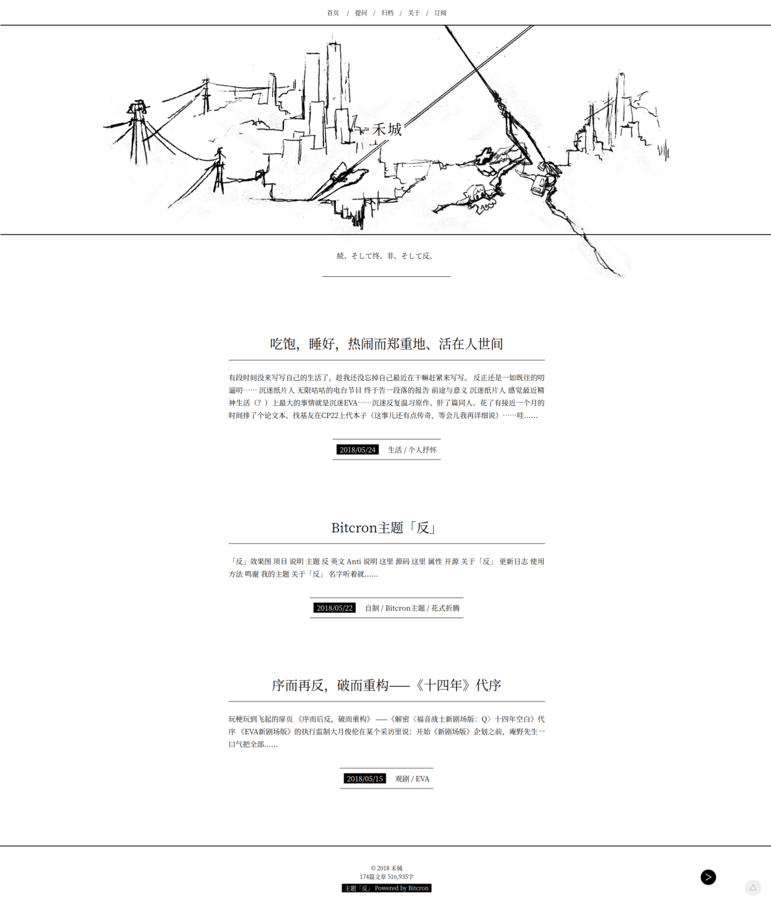

# Bitcron主题「反」



「反」效果图

| 项目 | 说明 |
| --- | --- |
| 主题 | 反 |
| 英文 | Anti |
| 说明 | [这里](/post/zi-zhi/bitcron-theme-anti) |
| 源码 | [这里](https://github.com/matrixk/bitcron-theme-anti) |
| 属性 | 开源 |

# 关于「反」

名字听着就很不吉利（不是，没有）。

兑现了之前说的写个新主题的诺言（……）而且速度挺快的，一晚上就写完，虽然跟初稿蓝图有点出入——本来是有网站头像的，后来怎么摆都觉得不太好看，就去掉了。

评论样式还是抄的Baco的代码，我写不出更好看的样式了……

依然保留了「素」里的预警和折叠功能。

预警功能的写法：

```
!Warning
“卷饼东一飞照指日可待！”
“电光毒龙钻警告.jpg”
```

注意中间不要有空行。

折叠功能还有点问题，晚点小海龙说会帮我看看～

折叠功能的写法是：

```
{{点开看看我写代码的时候都在想什么}}
庵野老贼到底什么时候出3.0+1.0，qswl。
```

默认头图并不是我图上那个，图上那个是我的发小、绛尧同学画的草稿……我就是看着这张觉得有点感觉所以拿来写了个主题。

默认设置下头图也并不会溢出边框……图只是因为我觉得让它溢出看起来比较有感觉（你可闭嘴吧）。

默认头图是个黑白照片，头图可以在`Dashboard-Images-Default Background`中更改，建议使用黑白照片或者绘画线稿，当然彩色的也没关系，我加了个去色滤镜（喂）。


# 更新日志

- 2018-05-22 发布主题
- 2018-05-21 开始肝主题

# 使用方法

在[Github](https://github.com/matrixk/bitcron-theme-anti)上下载源代码，然后把`template`放到你的根目录下就好了～

如果根目录下已有`template`文件夹，请直接覆盖ww

# 鸣谢

小海龙[@风海流](https://weibo.com/seadragondrift)

[水八口](https://blog.shuiba.co)
